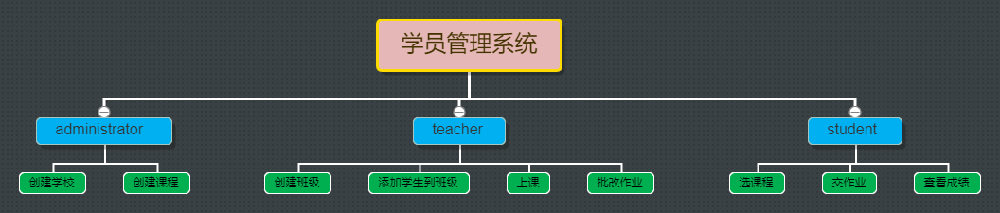
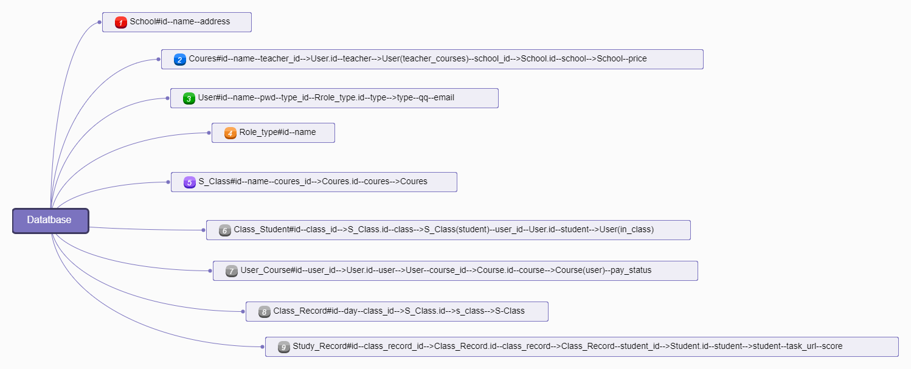

# sql版学院管理系统

## 作业要求

1. 用ORM对数据库进行管理
2. 按用户类型分别显示菜单，分为管理员、讲师、学员

```
管理员菜单
-创建学校
-创建课程=》创建过程关联讲师和学校
讲师菜单
-创建班级
-将学员加入班级
-给班级上课
-批改作业
学员菜单
-挑选课程
-提交作业
-查看成绩
```

### 测试

- 需要创建一个数据库

- 默认账号和密码

  管理员

  admin/admin  

  学生

  student/123.com

  老师 

  teacher/123.com 

  ​

  ## 文件结构

  ​

  - 主目录`conf/confing.ini`文件存储配置信息
  - `bin`目录为程序主入口
  - `sql_class.py`数据库
  - student_system.py 主要程序


   ### 流程图




###表结构




