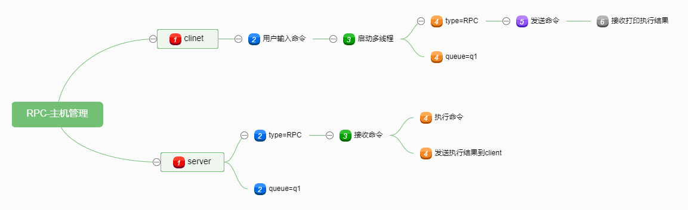

# RPC_RabbitMQ主机管理

## 作业要求

1.用RabbitMQ实现主机管理

2.客户端执行命令 run "cmd" --host 192.168.1.2 192.168.1.3

3.客户端执行 check_task id 获取执行结果

4.多线程异步执行，不需要等待

## 程序目录

### server

- server\bin\mian.py        程序入口
- server\conf\config.ini     配置文件
- server\core\server.py    主程序

### clinet

- client\bin\mian.py        程序入口
- client\conf\config.ini     配置文件
- client\core\clinet.py     主程序

###流程图

